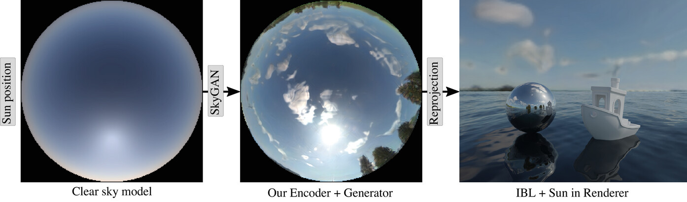

# SkyGAN

This repository contains the code for our paper [**SkyGAN: Realistic Cloud Imagery for Image-based Lighting**](https://doi.org/10.1111/cgf.14990).


*SkyGAN generates cloudy sky images from a user-chosen sun position that are readily usable as an environment map in any rendering system. We leverage an existing [clear sky model](https://cgg.mff.cuni.cz/publications/skymodel-2021/) to produce the input to our neural network which enhances the sky with clouds, haze and horizons learned from real photographs.*


## Project structure
Important files/directories:
- src/stylegan3: SkyGAN – modified [StyleGAN3](https://github.com/nvlabs/stylegan3) code with HDR support, implemented encoding of a clear sky generated by the Prague sky model, added reconstruction loss on the clear sky image, azimuth marginalization on data loading, modified visualizer etc.
  - environment.yml: the Conda environment for general use (use that by default)
  - environment_cluster.yml: exported Conda environment we trained in
  - environment_wsl.yml: exported Conda environment we used for running inference (generating preview images)
  - *_FID.py: modified files used for FID computation - replace the matching files if you want to run the evaluation
  - training/FID_prepare.ipynb: a Jupyter notebook used for processing training outputs, filtering and sorting the snapshots to progressively increase the data points density, and creating evaluation jobs
  - training/FID_plot.ipynb: a Jupyter notebook visualising the training progress
- train_cluster.sh: a PBS job launch script used to start training runs (training parameters were changed before each run; the example parameters in the file were used in the "Ours" run: resuming from a previous training which reached 8.7 Mimgs)
- generate_preview_samples.sh: a script we used for generating preview images included in the supplementary material
- ArPragueSkyModelGroundXYZ, sky_image_generator.*: the code and fitted data of the XYZ version of the Prague sky model used for generating a clear sky image passed to our network

## Downloads
The data-processing scripts are available in a separate repository TODO. The dataset and snapshots TODO.

## Usage
### Installation
1. Prepare the Conda environment using our `environment.yml` (or other environment we provided if you want to use the exact same package versions we did)
```
conda env create -f src/stylegan3/environment.yml
conda activate stylegan3
```
  - Make sure your conda is up to date with `conda update -n base conda`.
  - To avoid long waiting at "Solving Environment step", [switching to the libmamba solver](https://www.anaconda.com/blog/a-faster-conda-for-a-growing-community) is advisable.

2. Make sure gen_images.py (and visualizer.py?) from the original StyleGAN3 code run correctly (optional but useful for debugging)
  - clone the original [stylegan3](https://github.com/nvlabs/stylegan3) repository, change into its directory, then run the following:

```
python gen_images.py --outdir=out --trunc=1 --seeds=2,1 --network=https://api.ngc.nvidia.com/v2/models/nvidia/research/stylegan3/versions/1/files/stylegan3-r-afhqv2-512x512.pkl
```
  - Note that the first run will cause compilation of PyTorch plugins/kernels, which may take a couple of minutes.
  - If everything works, you should see a cat image in the "out" directory.

3. Build the sky_image_generator module (makes clear sky images, which are encoded in SkyGAN – used in botr training and inference)
```
g++-10 -O3 -Wall -shared -std=c++11 -fPIC -fopenmp $(python3 -m pybind11 --includes) -I"$CONDA_PREFIX"/include/opencv4/ -I"$CONDA_PREFIX"/lib/python3.9/site-packages/numpy/core/include/ -L"$CONDA_PREFIX"/lib/ sky_image_generator.cpp -o sky_image_generator$(python3-config --extension-suffix) -lopencv_core -lopencv_imgcodecs
cd src/stylegan3
```
then link the compiled module and its data to the current directory
```
ln -s ../../sky_image_generator$(python3-config --extension-suffix)
ln -s ../../ArPragueSkyModelGroundXYZ/
```

### Inference
Generate a few images using a pre-trained network:
```
CACHE_DIR=/tmp OPENCV_IO_ENABLE_OPENEXR=1 python gen_images.py --network /home/user/Downloads/k00133t_Ours_FID14.6@28.9M_network-snapshot-002343.pkl --normalize-azimuth=True --seeds='elevations+1000' --outdir=out --azimuth=180 --elevations=10,70
```
  - Replace `/home/user/Downloads/k00133t_Ours_FID14.6@28.9M_network-snapshot-002343.pkl` with a path to a pre-trained network weights.
  - The generated skies with clouds are named `fake_seed*.png|exr`; `clear_rec_*` outputs are the clear sky images as reconstructed by the network.
  - To generate images for a custom seed(s), change the `'elevations+1000'` (`--seeds` value) to a number, list of numbers or a range. Choose only one sun elevation per script run (and a different `outdir`) to avoid overwriting previously generated images.

Run the interactive visualizer, then select a training snapshot (.pkl) using the `Browse...` button on top of the window (tip: checking `Force FP32` makes it run faster, at least in WSL2 on Windows 10 with one 1080Ti)
```
./start_visualiser.sh --browse-dir /home/user/Downloads/
```
  - Replace `/home/user/Downloads/` with a path to a directory where you store your pickles.

### Training
- TODO test with dummy singleimage?


## Citation
If you find this work, the dataset or processing scripts useful in your research, please cite our paper:
```
@article{https://doi.org/10.1111/cgf.14990,
author = {Mirbauer, Martin and Rittig, Tobias and Iser, Tomáš and Křivánek, Jaroslav and Šikudová, Elena},
title = {SkyGAN: Realistic Cloud Imagery for Image-based Lighting},
journal = {Computer Graphics Forum},
volume = {n/a},
number = {n/a},
pages = {e14990},
keywords = {modelling; natural phenomena, rendering; image-based rendering, rendering; atmospheric effects},
doi = {https://doi.org/10.1111/cgf.14990},
url = {https://onlinelibrary.wiley.com/doi/abs/10.1111/cgf.14990},
eprint = {https://onlinelibrary.wiley.com/doi/pdf/10.1111/cgf.14990},
abstract = {Abstract Achieving photorealism when rendering virtual scenes in movies or architecture visualizations often depends on providing a realistic illumination and background. Typically, spherical environment maps serve both as a natural light source from the Sun and the sky, and as a background with clouds and a horizon. In practice, the input is either a static high-resolution HDR photograph manually captured on location in real conditions, or an analytical clear sky model that is dynamic, but cannot model clouds. Our approach bridges these two limited paradigms: a user can control the sun position and cloud coverage ratio, and generate a realistically looking environment map for these conditions. It is a hybrid data-driven analytical model based on a modified state-of-the-art GAN architecture, which is trained on matching pairs of physically-accurate clear sky radiance and HDR fisheye photographs of clouds. We demonstrate our results on renders of outdoor scenes under varying time, date and cloud covers. Our source code and a dataset of 39 000 HDR sky images are publicly available at https://github.com/CGGMFF/SkyGAN.}
}
```

## Coming soon
SkyGAN will work on Intel GPUs (or other SYCL-compatible accelerators). See the *StyleGAN3 to SYCL porting* progress in [this repository](https://github.com/martinmCGG/stylegan3).

### TODOs
 - [] finish usage instructions (how to run inference - copy from the PC in S126)
 - [] test if training+inference still work after code cleanup - WIP
 - [] link to trained pickles!
 - [] link to data processing scripts
 - [] link to dataset (academic torrents + Transmission on amnesia-compute?)
 - [] update citation when volume+number are known
 - [] maybe link to publication page on CGG website?
 - [] StyleGAN3 to SYCL porting: merge to SkyGAN when finished, maybe until then also add a guide how to merge the current version
